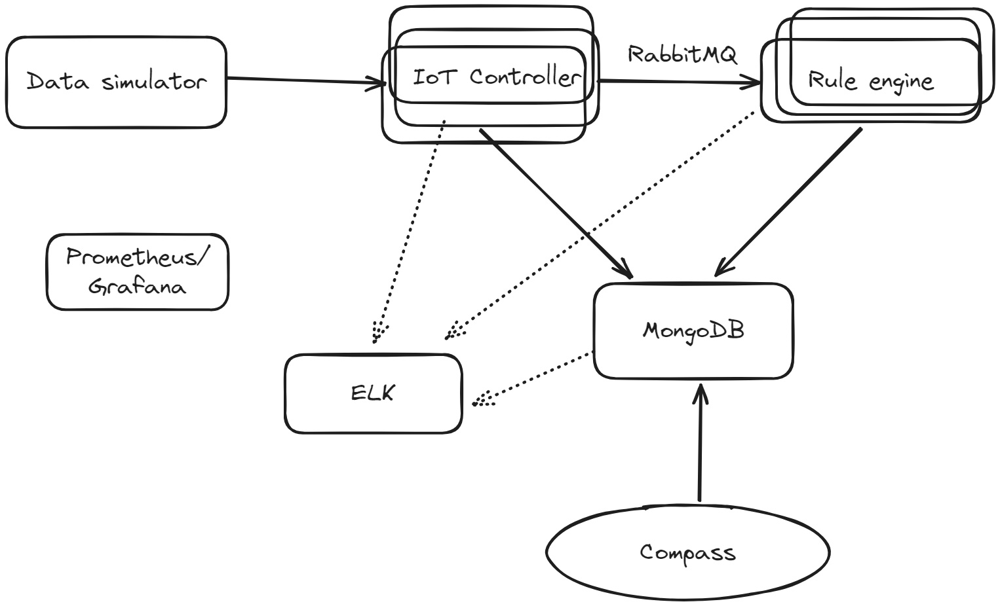

# Многоуровневая организация программных систем (МОПС)

## Лабораторное задание

Выполнил Граник Артем Владимирович, группа P4116.

### Цель

Отработка принципов и подходов к разработке современных многоуровневых сервисов при решении практической задачи.

### Задача

Разработать простое IoT решение и показать применение основных принципов разработки, которые обсуждались на лекции.

### Структура решения



### Основные компоненты 

- Data simulator - Простой генератор данных для разрабатываемого IoT решения. Позволяет указать количество симулируемых устройств и частоту сообщений, которые генерируются каждым из них. Например, 100 устройств и 1 сообщение в секунду с устройства.
- IoT контроллер - сервис, который принимает входные пакеты с данными от «устройств», подключенных к системе. Принимаемые пакеты валидируются и сохраняются в базу данных MongoDB.
- Rule engine - простой обработчик правил. Должен уметь обрабатывать мгновенные правила, т.е. основанные на конкретном пакете, и длящиеся, основанные на нескольких пакетах. Пакеты для обработки компонент получает от IoT контроллера через очередь сообщений.
  - Мгновенное правило - Значение поля А от устройства 42 больше 5.
  - Длящееся правило - Значение поля А от устройства 42 больше 5 на протяжении 10 пакетов от этого устройства.

### Дополнительные компоненты

- MongoDB - база данных, в которой хранятся IoT сообщения и отметки (например, алёрты) о срабатываниях правил, которые заложены в Rule Engine.
- Compass - приложение для просмотра содержимого базы данных MongoDB, будет использоваться вместо пользовательского интерфейса приложения.
- RabbitMQ - очередь сообщений для обмена данными между IoT Контроллером и Rule Engine
- Prometheus/Grafana - система для сбора и мониторинга метрик о работе приложения
- ELK Stack - система для сбора и просмотра логов разрабатываемого решения.

При выполнении работы можно использовать любой удобный язык программирования. Желательно выполнять работу на чистом Docker окружении, чтобы максимально разобраться в том, как работают компоненты на низком уровне. 

## Выполнение

Основные компоненты системы реализованы в формате веб-приложений, которые взаимодействуют друг с другом согласно формату,
описанному в лабораторном задании (подробные детали описаны в разделах, посвященных отдельным компонентам).
Все эти компоненты реализованы на языке программирования Java (17) с использованием фреймворка Spring-Boot (версия 3.4.1).

Дополнительные компоненты реализованы с помощью docker-образов, все компоненты системы, включая основные, 
собраны в единый docker-compose.yml (кроме Compass). 
Для взаимодействия с ними в основные компоненты также интегрированы необходимые библиотеки.

*[docker-compose.yml](docker-compose.yml)*

### Data simulator

Данный компонент генерирует сообщения и отправляет их IoT-Controller'у в формате http-запросов.

Сообщения имеют такой формат ([DeviceMessage](data_simulator/src/main/java/org/mops/model/DeviceMessage.java)):

```java
public class DeviceMessage {
    private int deviceId;
    private String validation;
    private int indication;
}
```

В нем содержится информация об "устройстве"-источнике, строка для валидации, которая используется для валидации сообщения
в IoT-Controller'е, и поле-индикатор, которое участвует в проверке правил. Примерно 1% сообщений генерируется невалидным.

Отправка сообщений осуществляется с помощью HttpClient'а, встроенного в jdk. Сообщения конвертируются в строки формата json
и отправляются в формате POST-запросов. Адрес, используемый для отправки сообщений, зависит от "источника" сообщения.

Для имитации множества устройств [используется ScheduledThreadPool](data_simulator/src/main/java/org/mops/service/DeviceMessageService.java).

Частоту отправки сообщений, количество имитируемых устройств, верхнюю границу индикатора и 
настройки соединения с IoT-Controller'ом можно настроить через [application.yml](data_simulator/src/main/resources/application.yml).

### IoT-Controller

Данный компонент принимает сообщения от Data Simulator'а и общается с Rule Engine посредством очередей RabbitMQ.

Для приема сообщений используется контроллер [DeviceMessageController](iot_controller/src/main/java/org/mops/controller/DeviceMessageController.java).
Далее принятые сообщения валидируются (проверка строки validation по шаблону *validation{deviceId}*). В случае, 
если сообщение валидно, оно сохраняется в БД Mongo и отправляется в Rule Engine с помощью RabbitMQ.

### Rule Engine

В данном компоненте сообщения от IoT Controller'а проверяются на соответствие набору правил.

Правила задаются через файл [application.yml](rule_engine/src/main/resources/application.yml). По умолчанию существует
1 мгновенное правило (indication > 30) и 1 длящееся правило (indication <= 30), срабатывающее, 
если условие выполняется в течение 10 сообщений от устройства. Для проверок длящихся правил используется доступ к БД.
При срабатывании правил в БД добавляются соответствующие записи.

### MongoDB

База данных Mongo работает в docker'е и используется для записи принятых сообщений от устройств и сообщений о срабатывании правил.

### Compass 

Для доступа к БД используется графический клиент Mongo Compass.

Сообщения от устройств в Compass.


Срабатывания правил


### RabbitMQ

RabbitMQ используется как очередь для обмена сообщениями между IoT Controller'ом и RuleEngine. 
Также имеет встроенный графический интерфейс для просмотра состояния очередей.

Интерфейс просмотра очередей.


### Prometheus + Grafana

Prometheus и Grafana реализованы с помощью образов docker.

Во всех компонентах настроен доступ к эндпоинтам Actuator.
Для сборки метрик во все основные компоненты добавлена библиотека Micrometer.

Метрики, собираемые по компонентам:
- Data Simulator:
    - device{deviceId}_sent_message_counter - счетчики количества отправленных сообщений по каждому "устройству".
- IoT Controller:
  - device{deviceId}_received_message_counter - счетчики принятых сообщений от каждого устройства.
  - device{deviceId}_invalid_message_counter - счетчики невалидных сообщений от каждого устройства.
- Rule Engine:
  - {ruleName}_rule_trigger_counter - счетчики срабатываний каждого правила.

На основе собранных метрик возможно строить дэшборды в Grafana.

Графики, отображающие количество сработавших правил.


### ELK (ElasticSearch, Logstash, Kibana) 

Для работы стэка ELK были настроены его компоненты. Логи компонентов системы отсылаются в Logstash, 
далее отправляются в ElasticSearch, Kibana позволяет просматривать их через удобный UI в браузере.

Для сбора логов с помощью LogStash произведена общая настройка через [logstash.conf](logstash.conf). 
Настроена фильтрация логов по компонентам для последующей настройки индексов.

Конфигурация:
```
input {
  tcp {
    port => 5044
    codec => json_lines
  }
}

filter {
  mutate {
    add_field => { "[@metadata][host]" => "%{host}" }
  }
}

output {
  elasticsearch {
    hosts => ["http://elasticsearch:9200"]
    index => "spring-boot-logs-%{[@metadata][host]}-%{+YYYY.MM.dd}"
  }
  stdout { codec => rubydebug }
}
```

Для отправки сообщений в каждом основном компоненты также добавлена конфигурация логирования с помощью
logback-spring.xml:
```xml
<configuration>
    <appender name="CONSOLE" class="ch.qos.logback.core.ConsoleAppender">
        <encoder>
            <pattern>%d{yyyy-MM-dd HH:mm:ss} - %msg%n</pattern>
        </encoder>
    </appender>

    <appender name="LOGSTASH" class="net.logstash.logback.appender.LogstashTcpSocketAppender">
        <destination>logstash:5044</destination>
        <encoder class="net.logstash.logback.encoder.LogstashEncoder"/>
    </appender>

    <root level="info">
        <appender-ref ref="CONSOLE"/>
        <appender-ref ref="LOGSTASH"/>
    </root>
</configuration>
```

В Kibana на основе полученных логов реализованы индексы для фильтрации по компоненту системы.

Просмотр логов Rule Engine через Kibana.


## Примененные принципы

В рамках разработанной системы были применены следующие принципы организации программных систем:

1. Minimize Coordination. Так как разработанная система достаточно простая, координация между компонентам минимальна.
Поэтому для дальнейшей оптимизации их взаимодействия в текущем виде используется только асинхронный обмен сообщениями 
через RabbitMQ. 
2. Redundancy. Для обеспечения избыточности используется одновременный сбор метрик через Prometheus и использование
ELK стэка. В логах и метриках учитываются все как отправленные, так и принятые сообщения. 
В текущих условиях функционирования системы это де-факто дублирование сбора данных.
3. Design for scale-out. Основные возможности для дальнейшего масштабирования системы заключаются в выборе 
легко-масштабируемых технологий, таких как RabbitMQ и MongoDB и использование микросервисов. 
Кроме того способы конфигурации компонентов позволяют легко увеличить количество сообщений и количество правил. 
4. Design for operations. Развертывание системы облегчено максимально за счет использования docker-compose.
Включение ELK и Prometheus/Grafana обеспечивает высокий Observability.
5. Design for evolution. Система разработана таким образом, что ее дальнейшее развитие достаточно просто. 
В первую очередь развивать систему необходимо путем дальнейшей реализации основных принципов организации в тех аспектах
системы, которые недостаточно им соответствуют. В текущем состоянии система предоставляет возможности для легкого 
развития с помощью использования docker и конфигурации компонентов.